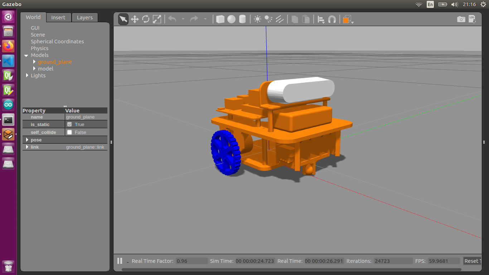

## Model robot using URDF and RViz
### Download and Install
```
$ cd [your_ws]/src
$ git clone https://github.com/DuyNamUET/simulation
$ cd ..
$ catkin_make
```
### Launch Robot
RViz
```
$ roslaunch simulation display.launch
```
Gazebo
```
$ roslaunch simulation gazebo.launch
```
### Control Robot
Using keyboard as controller
```
    8
4   5   6
    2
```
Max speed robot: 2m/s
### Result
Rviz

Gazebo
