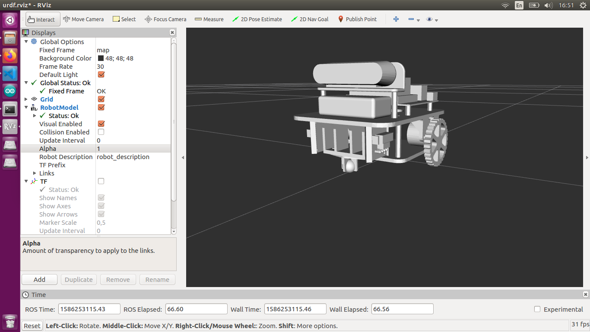

## Model robot using URDF and RViz
### Download and Install
```
$ cd [your_ws]/src
$ git clone https://github.com/DuyNamUET/simulation
$ cd ..
$ catkin_make
```
### Launch Robot
```
$ roslaunch simulation display.launch
```
### Control Robot
Using keyboard as controller
```
    i
j   k   l
    ,
```
Max speed robot: 2m/s
### Result

